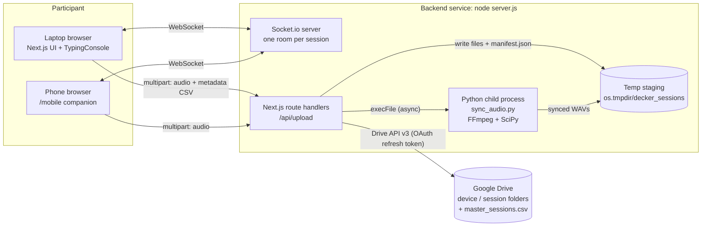
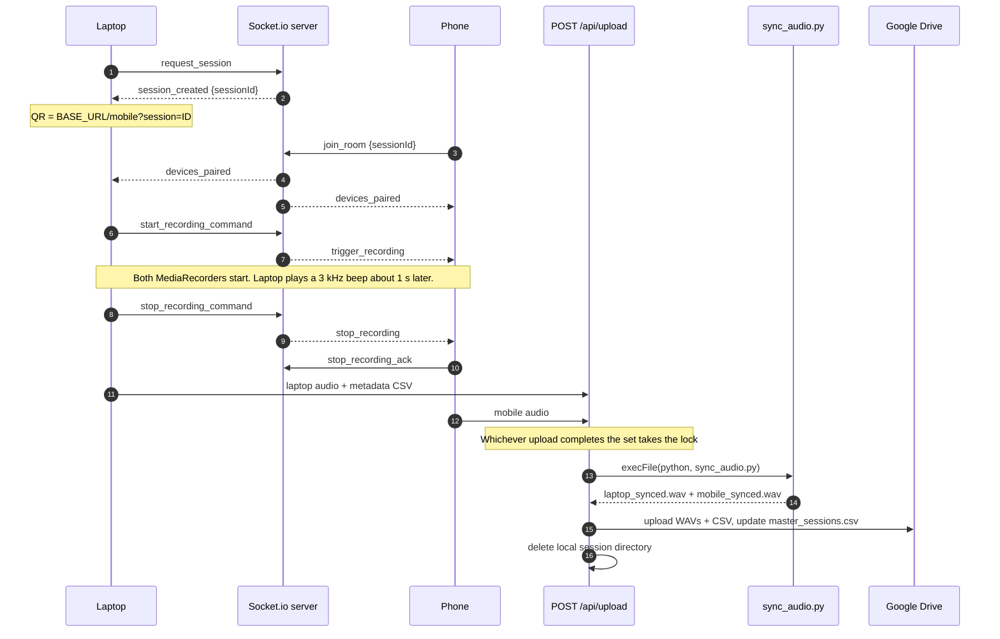

<div align="center">

# DECKER+ Dataset Keyboard Recorder

**A dual-device data-collection platform that captures synchronized laptop keystrokes, laptop audio and phone audio, aligns the two audio streams to the sample, and archives everything to Google Drive.**

[](https://nextjs.org/)
[](https://react.dev/)
[](https://socket.io/)
[](https://www.python.org/)
[](https://ffmpeg.org/)
[](https://developers.google.com/drive/api)
[](https://tailwindcss.com/)

[**Live demo**](https://decker-dataset-framework-bjxv.vercel.app/)

</div>

---

## Table of contents

1. [Overview](#overview)
2. [Key features](#key-features)
3. [Architecture at a glance](#architecture-at-a-glance)
4. [How a session works](#how-a-session-works)
5. [The synchronization model](#the-synchronization-model)
6. [System design decisions](#system-design-decisions)
7. [Performance optimizations](#performance-optimizations)
8. [Reliability and robustness](#reliability-and-robustness)
9. [APIs and integrations](#apis-and-integrations)
10. [Data model and outputs](#data-model-and-outputs)
11. [Tech stack](#tech-stack)
12. [Folder structure](#folder-structure)
13. [Local development](#local-development)
14. [Production deployment](#production-deployment)
15. [Verifying alignment quality](#verifying-alignment-quality)
16. [Troubleshooting](#troubleshooting)
17. [Security and privacy](#security-and-privacy)
18. [Known issues and roadmap](#known-issues-and-roadmap)

---

## Overview

DECKER+ is a dual-device data-collection app for research on keyboard acoustics. A participant types a standardized paragraph on their **laptop** while the laptop microphone and a paired **phone** microphone both record. The laptop logs every key-down and key-up with sub-millisecond-resolution timestamps.

The app is built on a custom Next.js server with Socket.io for real-time pairing and recording triggers. The pipeline records keystrokes and audio, aligns the laptop and mobile audio using a sync beep in Python, and uploads the synchronized files to Google Drive.

### What this builds

- **Laptop dashboard** for session setup, device metadata, participant details, and typing capture.
- **Mobile companion page** that pairs via QR code and records phone audio.
- **Backend upload pipeline** that waits for laptop audio, mobile audio and the CSV, runs Python audio sync, and uploads the results to Google Drive.

## Key features

- Session pairing over Socket.io with a QR link.
- Synchronized recording trigger across laptop and mobile.
- Keystroke logging with high-resolution timestamps (`performance.now()`).
- Audio sync using a 3000 Hz beep plus FFT cross-correlation.
- OAuth-based Google Drive upload (one-time admin setup, no participant login).
- Raw, unprocessed microphone capture (echo cancellation, noise suppression and auto-gain are explicitly disabled).
- Monkeytype-style typing interface with paste/drop blocking and live error highlighting.
- Cross-platform hardware fingerprinting through copy-paste PowerShell / bash / zsh scripts.
- Automatic per-device and per-session Drive folders, plus a master index CSV (`master_sessions.csv`) with one row per session.
- Automatic temp-file cleanup, both after each successful upload and on an hourly janitor.

---

## Architecture at a glance



**One process serves everything.** `server.js` creates a single Node HTTP server, hands every HTTP request to the Next.js request handler, and attaches Socket.io to the same server on `/socket.io`. That gives one port, one deployable, and same-origin sockets and API calls.

**CPU-heavy work is isolated.** Audio decoding and signal processing run in a separate Python process spawned per session, so the Node event loop that serves WebSockets is never blocked.

**State lives on disk, not in a database.** Each session gets a directory in the OS temp folder with a small `manifest.json` describing what has arrived. This keeps the system dependency-free (no Redis, no Postgres) at the cost of being a single-instance design.

### Deployment topology

The Vercel deployment can't host a long-lived WebSocket server or the Python/FFmpeg pipeline, so the app is deployed as two cooperating pieces:

| Piece | Runs | Responsibility |
|---|---|---|
| **Frontend** | Vercel ([live demo](https://decker-dataset-framework-bjxv.vercel.app/)) | Serves the laptop UI and `/mobile` page. |
| **Realtime + processing backend** | A long-lived Node/Python host running `node server.js` (`Procfile`, `nixpacks.toml` and `aptfile` are provided) | Socket.io, `/api/upload`, Python sync, Drive upload. |

The frontend reads `NEXT_PUBLIC_SOCKET_URL` and uses it for **both** the Socket.io connection and the `/api/upload` calls, so audio bytes go straight to the backend rather than through Vercel. This is why `next.config.ts` sets permissive CORS headers on `/api/*`.

---

## How a session works

1. Laptop requests a session ID from Socket.io.
2. QR encodes the mobile URL with the session ID.
3. Mobile joins the same Socket.io room via the QR URL.
4. Laptop "Start Recording" triggers recording on both devices.
5. Laptop "Stop Recording" stops both; both upload audio; laptop uploads CSV.
6. Backend waits for all 3 files, runs Python sync, uploads WAVs + CSV to Drive.

The same flow in more detail:



---

## The synchronization model

The hardest problem in this project is aligning three independent timelines: the laptop's audio, the phone's audio, and the keystroke log. The two devices have unsynchronized clocks and start recording at slightly different moments, so **timestamps from the two devices can't be compared directly**. Instead, DECKER+ puts a shared marker *into the audio signal itself*.

```
t = 0 s      Both MediaRecorders start (start commands arrive over Socket.io)
t ≈ 1.0 s    Laptop plays a 3000 Hz, 200 ms sine beep through its speakers
             └─ performance.now() is captured at oscillator.start() and becomes
                the zero point (t = 0) of every keystroke timestamp in the CSV
t > 1.0 s    Participant types; each key-down / key-up is logged as
             (action, key, ms since beep)
```

Because the beep is played by the laptop speaker, **both microphones hear it**. The Python pipeline then:

1. Decodes both recordings to mono 48 kHz WAV with FFmpeg.
2. Crops the first 30 s of each stream (the beep is at about 1 s).
3. Band-pass filters 2.5 to 3.5 kHz so the 3 kHz beep dominates over speech, room noise and typing.
4. Computes the **FFT cross-correlation** of the two filtered crops. The peak position gives the sample offset (`lag`) between the streams.
5. Trims the head of whichever stream started earlier, truncates both to the same length, and writes two sample-aligned WAV files.

### Why a beep instead of clock synchronization?

Two consumer devices have no shared clock, and a web page can't query another device's clock to better than network jitter. An acoustic marker is observed by both devices *in their own recorded signal*, so no clock agreement is needed at all. The alignment error is bounded by DSP resolution (one sample at 48 kHz is about 21 microseconds), not by network latency.

### Precision notes

- Alignment between the two WAVs is **sample-accurate by construction** of the cross-correlation peak.
- The mapping from CSV time to audio time (`beep onset + timestamp_ms`) has a small residual error from browser audio output latency, which isn't compensated. Use [`verify_beep_alignment.py`](#verifying-alignment-quality) to inspect it.
- The phone hears the beep after acoustic propagation delay (about 2.9 ms per metre), which is inherent to the setup.

---

## System design decisions

A compact decision log: what we chose, why, and what it costs.

| Decision | Why | Trade-off |
|---|---|---|
| **Custom `server.js` wrapping Next.js + Socket.io** | Next.js route handlers can't host a persistent WebSocket server. One Node process gives one port, one deploy, and same-origin sockets and APIs. | Can't be deployed as serverless functions, hence the split Vercel + backend topology. |
| **Socket.io rooms (`room:<sessionId>`)** | A room is a natural per-session channel: the laptop's command is broadcast to whoever joined. Socket.io also brings automatic reconnection and transport fallback (WebSocket to long-polling). | Horizontal scaling would need sticky sessions or a Redis adapter. |
| **QR-code pairing** | The phone opens a normal URL; no app install and no typing a code. The session ID rides in the query string. | The QR image is rendered by a third-party API (see [Security and privacy](#security-and-privacy)). |
| **Browser capture (`MediaRecorder`) instead of a native app** | Zero install, works on any laptop OS and any phone. | Container/codec differs per browser (WebM/Opus on Chromium, MP4/AAC on Safari), so we normalize with FFmpeg server-side. |
| **Raw audio constraints** (`echoCancellation`, `noiseSuppression`, `autoGainControl` all `false`) | These DSP stages would suppress or distort keystroke transients, which are the actual signal of interest in a keyboard-acoustics dataset. | Recordings include all room noise; that's intended for the research use case. |
| **Acoustic sync beep + cross-correlation** | See [the synchronization model](#the-synchronization-model). Needs no shared clock. | Requires the phone to be within earshot of the laptop speaker. |
| **High-resolution monotonic timestamps** (`performance.now()`) | Unaffected by system-clock adjustments, with sub-millisecond resolution. All times are relative to the beep. | Browsers may coarsen timer precision for privacy; ms-level rounding is applied before storing. |
| **Python for DSP, called as a child process** | SciPy/NumPy/FFmpeg are the right tools for filtering and correlation. A separate process gives true multi-core parallelism and means a crash or memory spike can't take down the socket server. | Cold-start cost per session (interpreter + imports); requires Python and FFmpeg on the backend host. |
| **Fire-and-forget processing** | `/api/upload` returns as soon as the file is saved. The participant never waits for decode, DSP and Drive upload. | No built-in retry queue or status endpoint (see [roadmap](#known-issues-and-roadmap)). |
| **Disk staging + `manifest.json` instead of a database** | No extra infrastructure. The manifest records which of the three files have arrived, so uploads can land in **any order** and whichever completes the set triggers processing. | Single-instance design; state is lost if the container's temp disk is wiped. |
| **OAuth refresh token instead of a service account** | Service accounts have no Drive storage quota ("Service Accounts do not have storage quota"). A one-time admin consent yields a long-lived refresh token, so participants never log in. | The token is a powerful secret and must be protected (see [Security and privacy](#security-and-privacy)). |
| **Device and session folder hierarchy + master CSV** | `Parent/<DEVICE_ID>/<SESSION_ID>/…` groups sessions by machine. `master_sessions.csv` gives a flat, analysis-ready index of every session's metadata. | The master CSV is a read-modify-write on a single Drive file. |
| **Hardware info through copy-paste scripts** | Browsers deliberately hide CPU, RAM, audio driver and Wi-Fi details. A script run in the user's own terminal can read them without installing anything, and the output is parsed into editable fields. | Relies on the participant following the steps; fields stay editable as a fallback. |
| **Monkeytype-style typing box** | A hidden 1-pixel `<textarea>` receives the real keystrokes (so IME, focus and key events behave natively) while a rendered overlay shows per-character correctness. Paste and drop are blocked. Typing the exact target text gives clean labels. | Per-character spans re-render on each keystroke (negligible at about 800 characters). |

---

## Performance optimizations

### Python audio pipeline (`src/python_scripts/sync_audio.py`)

The earlier version of the script ran the band-pass filter and correlation over the **entire** recording of both devices. The current version restructures the work so cost no longer grows with session length.

| # | Optimization | What it does | Why it matters |
|---|---|---|---|
| 1 | **Crop to 30 s before filtering** | Only the first 30 s of each stream is band-passed and correlated for lag detection. The full-length arrays are used only for the final trim. | The beep is at about 1 s, so 30 s is ample. This turns the dominant cost from *O(session length)* into *O(constant)*, and it also restricts the search to the region where the beep lives. |
| 2 | **Explicit FFT correlation** (`signal.correlate(..., method="fft")`) | Forces the O(N log N) FFT path. | A direct (time-domain) correlation of two multi-million-sample signals is O(N·M) and would be infeasible. Being explicit guards against a slow fallback. |
| 3 | **Zero-phase band-pass** (`butter(4)` + `filtfilt`, 2.5 to 3.5 kHz) | Isolates the 3 kHz beep. `filtfilt` runs the filter forward and backward. | Zero phase distortion means the filter can't shift the correlation peak and bias the lag. |
| 4 | **Single normalized format** (FFmpeg to mono, 48 kHz WAV) | Decouples the DSP from whatever codec/container the browser produced and guarantees both streams share a sample rate. | A lag measured in samples is only meaningful if both streams have the same rate; the script asserts this after conversion. |
| 5 | **`float32` working arrays** | Audio is loaded as 32-bit floats instead of NumPy's default 64-bit. | Halves the memory footprint of every intermediate array. |
| 6 | **Explicit memory release** (`del` of crops, filtered arrays, correlation output, raw arrays) | Large temporaries are freed as soon as they're no longer needed. | Keeps peak RSS low on small backend instances. |
| 7 | **In-place int16 conversion** | Normalize (`/=`), clip (`np.clip(..., out=data)`) and scale (`*=`) all mutate the array in place. | Avoids allocating a new full-length array for each step (the earlier `librosa.util.normalize` + clip + scale chain made several copies). |
| 8 | **Zero-copy alignment** | Trimming uses NumPy slicing, which returns views, not copies. | No extra memory to align the streams. |
| 9 | **Sequential write-then-free** | Each aligned channel is written to disk and deleted before the next is converted/written. | The two full-length channels never coexist in their largest form. |
| 10 | **`quiet=True` on FFmpeg** | FFmpeg's output is captured by the wrapper instead of streamed. | Keeps logs clean and keeps FFmpeg's verbose stderr out of the Node-side `execFile` capture. |

#### Measured impact

Benchmarked on synthetic sessions (48 kHz mono, keystroke-like clicks plus a 3 kHz beep, encoded to WebM/Opus like a browser would, with the phone starting 0.35 s late). "Before" is the earlier version of `sync_audio.py` preserved in the `codebase.txt` snapshot; "after" is the current one. Wall time includes FFmpeg decoding.

| Session length | Before: time | Before: peak RAM | After: time | After: peak RAM |
|---:|---:|---:|---:|---:|
| 1 min | 3.9 s | 468 MB | **1.6 s** | **309 MB** |
| 4 min | 11.7 s | 1,446 MB | **2.5 s** | **374 MB** |
| 10 min | 27.0 s | 3,401 MB | **5.4 s** | **506 MB** |

Stage-level breakdown for the 4-minute case (Python-side allocations):

| Stage | Before | After |
|---|---:|---:|
| Lag detection (filter + correlate) | 9.3 s, 737 MB peak | **0.28 s, 115 MB peak** |
| int16 conversion (per channel) | 1.07 s, 256 MB peak | **0.03 s, 46 MB peak** |

The "before" cost grows with recording length, while the "after" cost is dominated by FFmpeg decoding, which is a much gentler slope. The recovered lag matched the injected offset (16,800 samples) in the current version.

> **Method note:** these are indicative numbers from a synthetic benchmark on a development sandbox, not production measurements. Ratios matter more than absolutes; real recordings and your host's CPU will differ.

### Node.js backend

- **Non-blocking child process.** Python is launched with `execFile` wrapped in a Promise. Node keeps serving sockets and uploads while the DSP runs. Using `execFile` (an argument array, no shell) also removes any shell-injection surface.
- **Process-level parallelism.** Each session spawns its own Python process, so concurrent sessions run on separate cores and the GIL is irrelevant.
- **Streaming uploads to Drive.** WAV and CSV files are sent with `fs.createReadStream`, so memory use is constant regardless of file size. Files are never fully loaded into RAM.
- **Fast acknowledgement.** The upload handler returns once files are persisted; processing continues in the background.
- **Parallel filesystem work.** Cleanup uses `Promise.all` to delete files and scan sessions concurrently.
- **Serialized counter updates.** The session counter is guarded by a promise-chain mutex, so simultaneous `request_session` events can't race on the counter file.

### Browser clients

- **Microphone acquired once, at page load.** `getUserMedia` and the `MediaRecorder` are created up front, so pressing "Start" has near-zero latency and no permission prompt mid-session.
- **`AudioContext` created inside the click handler.** Browsers' autoplay policies require a user gesture to create or resume an audio context. Creating it synchronously on the click guarantees the beep will actually play 1 s later.
- **Refs for hot paths.** Keystrokes, audio chunks and the recording flag live in `useRef`, not React state, so logging a key never triggers a re-render and avoids stale-closure bugs.
- **Chunked recording.** `MediaRecorder.start(1000)` emits a chunk every second, so audio is accumulated incrementally instead of in one monolithic buffer.
- **Self-hosted fonts.** `next/font` downloads Space Grotesk and IBM Plex Mono at build time and serves them from the app's own origin (no runtime request to Google Fonts).
- **Tailwind CSS v4.** Build-time CSS generation with no runtime styling cost.

---

## Reliability and robustness

| Concern | How it's handled |
|---|---|
| **Uploads arrive in any order** | A per-session `manifest.json` records `laptopAudio`, `mobileAudio` and `metadataCsv`. After saving a file, the handler re-reads the manifest and merges, so concurrent uploads don't overwrite each other's entries. |
| **Processing must run exactly once** | When the manifest is complete, the handler creates a `processing.lock` file in the session directory. Later requests see the lock and return without starting a second pipeline. |
| **Which device names the Drive folder?** | The laptop's device ID always wins; the phone's ID is used only if no laptop ID has arrived yet. The folder name is therefore deterministic regardless of upload order. |
| **Duplicate start/stop commands** | `recordingRef`, the recorder's `state`, and the React `status` are all checked. The laptop is itself in the Socket.io room, so it receives its own broadcast `trigger_recording`, and the guard makes that a no-op. |
| **Keystrokes outside the valid window** | Events are dropped unless recording is active *and* the beep time has been set. Auto-repeat events (`event.repeat`) are ignored, so a held key logs exactly one down and one up. |
| **Mobile screen sleeping mid-recording** | The mobile page requests a Screen Wake Lock. |
| **Network blips on mobile** | Socket.io auto-reconnects, and the mobile client re-emits `join_room` on every `connect`, so it rejoins its session. |
| **Unknown or mislabeled audio containers** | The file extension is derived from the upload name (defaulting to `.webm`). FFmpeg generally detects the real container from the file's content, so a mislabeled file (for example Safari's MP4) still decodes. |
| **Unexpected sample rate** | The script raises an error if either stream isn't 48 kHz after conversion, rather than computing a meaningless lag. |
| **Unsafe characters in Drive names** | `sanitizeDriveName` replaces reserved characters, collapses whitespace and caps names at 64 characters. |
| **XSS on the OAuth callback** | The refresh token is HTML-escaped before it's rendered. |
| **Missing configuration** | OAuth routes and the Drive client validate required environment variables up front and return a clear error. |
| **Idempotent Drive folders** | `ensureFolder` looks a folder up by name, parent and MIME type before creating it, so retries don't create duplicates. |
| **Master CSV safety** | Values are RFC-4180 escaped (`escapeCsvValue`); the header is always rewritten; row IDs are derived from the existing data rows. |
| **Disk hygiene** | A successful session deletes its directory immediately. An hourly janitor (also run at boot) removes any file older than one hour and any empty session folder, covering crashed or abandoned sessions. |
| **Unique session IDs** | `DECKER_SESS_YYYYMMDD_HHMMSS_<counter>_<RAND>`: a timestamp, a mutex-protected persistent counter, and a random suffix. Even if the temp-disk counter resets, the timestamp and suffix keep IDs distinct. |
| **Reproducible builds** | `requirements.txt` pins exact versions. On Python 3.13 the standard-library modules `audioop`, `aifc`, `chunk` and `sunau` were removed, so `audioop-lts`, `standard-aifc`, `standard-chunk` and `standard-sunau` are pinned as drop-in replacements for `audioread`/`librosa`. |

---

## APIs and integrations

### External services

| Service | Used for | Where |
|---|---|---|
| **Google Drive API v3** (`googleapis`) | `files.list` (find-or-create folders, locate the master CSV), `files.create` (folders and uploads), `files.update` (master CSV), `files.get?alt=media` (download master CSV). | `src/lib/googleDriveClient.js`, `src/app/api/upload/route.js` |
| **Google OAuth 2.0** (authorization-code flow, `access_type=offline`, `prompt=consent`) | One-time admin consent that yields a refresh token. The Drive client exchanges it for short-lived access tokens automatically. | `src/app/api/oauth`, `src/app/api/oauth2callback` |
| **QR Server API** (`api.qrserver.com/v1/create-qr-code`) | Renders the pairing QR image, so no QR library is bundled. | `src/components/QRCodeDisplay.js` |
| **Google Forms** | Participant consent form (external link). | `src/app/page.tsx` |

### Browser Web APIs

| API | Purpose |
|---|---|
| `MediaDevices.getUserMedia` with DSP disabled | Raw microphone capture. |
| `MediaRecorder` | Encoding the microphone stream into chunks. |
| Web Audio API (`AudioContext`, `OscillatorNode`, `GainNode`) | Generating the 3000 Hz sync beep. |
| `performance.now()` | Monotonic, high-resolution keystroke timestamps. |
| `KeyboardEvent` (`keydown`, `keyup`, `repeat`) | Keystroke capture. |
| Screen Wake Lock API | Keeping the phone awake while recording. |
| Clipboard API (with `execCommand("copy")` fallback) | Copying the hardware-info scripts, including on non-secure origins. |
| `localStorage` | Persisting a stable per-browser `decker_device_id`. |
| `FormData` / `fetch` | Multipart upload of audio and CSV. |

### Internal HTTP API

| Method and path | Purpose |
|---|---|
| `POST /api/upload` | Receives `multipart/form-data`. Fields: `sessionId`, `device` (`laptop` or `mobile`), `device_id`, `audio` (file), and `metadata_csv` (file, laptop only). Responds `{ ok, sessionId, device }`. Runs on the Node.js runtime with `force-dynamic`. |
| `GET /api/oauth` | Starts the one-time Google consent flow. |
| `GET /api/oauth2callback` | Exchanges the authorization code and displays the refresh token to copy into `REFRESH_TOKEN`. |

### Socket.io events (path `/socket.io`)

| Event | Direction | Payload | Effect |
|---|---|---|---|
| `request_session` | laptop to server | none | Server generates a session ID and joins the laptop to `room:<id>`. |
| `session_created` | server to laptop | `{ sessionId }` | Laptop builds the QR URL. |
| `join_room` | phone to server | `{ sessionId }` | Phone joins the room; server broadcasts `devices_paired`. |
| `devices_paired` | server to room | `{ sessionId }` | Phone shows "Laptop paired". |
| `start_recording_command` | laptop to server | `{ sessionId }` | Server broadcasts `trigger_recording` to the room. |
| `trigger_recording` | server to room | `{ sessionId }` | Phone starts recording (laptop ignores the duplicate). |
| `stop_recording_command` | laptop to server | `{ sessionId }` | Server broadcasts `stop_recording` to the room. |
| `stop_recording` | server to room | `{ sessionId }` | Phone stops, finalizes and uploads. |
| `stop_recording_ack` | phone to server | `{ sessionId }` | Logged server-side for diagnostics. |
| `error` | server to client | `{ message }` | Sent when `sessionId` is missing. |

---

## Data model and outputs

### Google Drive layout

```
<DRIVE_PARENT_FOLDER_ID>/
├── master_sessions.csv                  # one row per session (metadata index)
└── <DEVICE_ID>/                         # e.g. DEVICE_windows_chrome_k3x9ab
    └── <SESSION_ID>/                    # e.g. DECKER_SESS_20260312_101530_0042_9QK2
        ├── <SESSION_ID>_laptop_synced.wav
        ├── <SESSION_ID>_mobile_synced.wav
        └── metadata.csv
```

The original browser recordings and intermediate `*_raw.wav` files are deleted after a successful upload. Only the synchronized WAVs and the CSV are retained. Set `DRIVE_CREATE_SESSION_FOLDER=false` to write files directly into the parent folder instead of creating per-device/per-session folders.

### Per-session `metadata.csv`

A single self-describing file with two blocks: device and participant metadata, then the keystroke log.

```
metadata_key,metadata_value
session_id,DECKER_SESS_20260312_101530_0042_9QK2
device_id,DEVICE_windows_chrome_k3x9ab
operating_system,Windows
...
action,key,timestamp_ms
down,T,1204
up,T,1278
```

`timestamp_ms` is milliseconds **since the sync beep** (`t = 0` is the beep).

### `master_sessions.csv`

<details>
<summary>Columns (click to expand)</summary>

`row_id` followed by:

| Group | Fields |
|---|---|
| Session | `session_id`, `device_id` |
| Software | `operating_system`, `browser_name` |
| Hardware | `laptop_make`, `laptop_model`, `cpu_model`, `ram_gb`, `screen_resolution`, `battery_status`, `wifi_signal_strength`, `audio_device_name`, `audio_driver_version`, `keyboard_layout_locale` |
| Participant | `person_no`, `age_range`, `gender`, `dominant_hand`, `years_keyboard_use`, `profession_field`, `keyboard_type` |
| Environment | `room_type`, `voip_type`, `noise_cancellation`, `microphone_mode` |

</details>

### Typing target

Participants type a fixed paragraph designed for full keyboard coverage: a pangram, a second pangram, digit sequences forward and backward, punctuation, symbols and operators, uppercase acronyms, and a final mixed sentence with brackets, braces and parentheses.

---

## Tech stack

| Layer | Technology |
|---|---|
| Framework | Next.js 16.2 (App Router) on a custom Node HTTP server, React 19.2 |
| Real-time | Socket.io 4.8 (server and client) |
| Styling | Tailwind CSS 4, `next/font` (Space Grotesk, IBM Plex Mono) |
| Language | JavaScript and TypeScript 5 (`allowJs`, strict mode) |
| Audio / DSP | FFmpeg, `ffmpeg-python`, NumPy, SciPy (`signal`, `io.wavfile`), librosa (used by the verification tool) |
| Google | `googleapis` 172 (Drive v3, OAuth2) |
| Tooling | ESLint 9 with `eslint-config-next` |
| Build / host | Vercel (frontend); Nixpacks / Procfile / aptfile (backend) |

`AGENTS.md` and `CLAUDE.md` contain instructions for AI coding assistants working in this repository.

---

## Folder structure

```
/
├── server.js                       # Custom HTTP server: Next.js + Socket.io, session IDs, temp cleanup
├── Procfile                        # web: node server.js
├── nixpacks.toml                   # Build config: Node 20, Python 3.13, FFmpeg
├── aptfile                         # System package: ffmpeg
├── requirements.txt                # Pinned Python dependencies
├── package.json
├── next.config.ts                  # CORS headers for /api/*
├── eslint.config.mjs
├── tsconfig.json
├── AGENTS.md / CLAUDE.md           # AI-assistant instructions
├── service-account-key.json        # (ignored; legacy, not used)
└── src/
    ├── app/
    │   ├── page.tsx                # Laptop dashboard
    │   ├── layout.tsx              # Root layout + fonts
    │   ├── globals.css             # Theme tokens + animations
    │   ├── mobile/
    │   │   ├── page.js             # Suspense wrapper
    │   │   └── MobileClient.js     # Phone companion: pairing, wake lock, recording, upload
    │   └── api/
    │       ├── upload/route.js         # Ingest, manifest, lock, Python sync, Drive upload
    │       ├── oauth/route.js          # Start Google consent
    │       └── oauth2callback/route.js # Show refresh token
    ├── components/
    │   ├── QRCodeDisplay.js        # Pairing QR
    │   ├── TerminalScripts.js      # OS-specific hardware-info scripts + output parser
    │   └── TypingConsole.js        # Recorder, beep, keystroke logger, typing UI
    ├── lib/
    │   └── googleDriveClient.js    # Drive helpers: ensureFolder, upload, upsert, download
    └── python_scripts/
        ├── sync_audio.py               # Convert, band-pass, cross-correlate, align, write
        └── verify_beep_alignment.py    # QA tool: beep time vs first keystroke
```

---

## Local development

### 1) Install Node dependencies

```
npm install
```

### 2) Python setup

Use a local venv and install Python deps.

```
python -m venv .venv
source .venv/bin/activate
pip install -r requirements.txt
```

### 3) System deps

Install ffmpeg (system binary).

```
ffmpeg -version
```

### 4) Environment variables

Create `.env.local`:

```
NEXT_PUBLIC_BASE_URL=https://<your-devtunnel-host>
NEXT_PUBLIC_SOCKET_URL=https://<your-devtunnel-host>
PYTHON_PATH=/absolute/path/to/.venv/bin/python

CLIENT_ID=...
CLIENT_SECRET=...
OAUTH_REDIRECT_URI=https://<your-devtunnel-host>/api/oauth2callback
REFRESH_TOKEN=...
DRIVE_PARENT_FOLDER_ID=<your-drive-folder-id>
```

What each variable does:

- `NEXT_PUBLIC_BASE_URL`: The URL used to build the QR code. In dev, this should be your HTTPS dev-tunnel host so the phone opens the correct URL.
- `NEXT_PUBLIC_SOCKET_URL`: Socket.io server origin used by both laptop + mobile (and as the base for `/api/upload`). Must match the URL the phone can reach (usually the same dev-tunnel host).
- `PYTHON_PATH`: Absolute path to the Python interpreter used for `sync_audio.py`. Use your venv python. Defaults to `python3` if unset.
- `CLIENT_ID`: OAuth client ID from Google Cloud Console.
- `CLIENT_SECRET`: OAuth client secret from Google Cloud Console.
- `OAUTH_REDIRECT_URI`: Must exactly match the redirect URI registered in Google Cloud. For dev tunnel it looks like `https://<devtunnel>/api/oauth2callback`.
- `REFRESH_TOKEN`: One-time OAuth refresh token generated from `/api/oauth`. The server uses this to get access tokens without user login.
- `DRIVE_PARENT_FOLDER_ID`: Google Drive folder where session folders/files are stored. (If unset, the code falls back to a built-in default folder ID, so set this explicitly for your own deployment.)

Optional variables:

- `DRIVE_CREATE_SESSION_FOLDER`: `true` (default) creates `<device>/<session>` subfolders; `false` uploads straight into the parent folder.
- `PORT`: HTTP port for `server.js` (default `3000`).
- `NODE_ENV`: `production` switches Next.js out of dev mode.

Common dev values (example):

```
NEXT_PUBLIC_BASE_URL=https://b9bsnfsg-3000.inc1.devtunnels.ms
NEXT_PUBLIC_SOCKET_URL=https://b9bsnfsg-3000.inc1.devtunnels.ms
OAUTH_REDIRECT_URI=https://b9bsnfsg-3000.inc1.devtunnels.ms/api/oauth2callback
```

### 5) One-time OAuth setup

- Visit `/api/oauth`
- Complete consent
- Copy refresh token from `/api/oauth2callback`
- Add `REFRESH_TOKEN` to `.env.local`

### 6) Start dev server

```
npm run dev
```

`npm run dev` runs `node server.js` (not `next dev`), so Socket.io and Next.js share one process, exactly as in production.

Open the laptop UI on the devtunnel URL so sockets + QR are same-origin.

### Runtime notes

- Mobile mic requires HTTPS. Use a dev tunnel for mobile testing.
- Socket.io pairing depends on both clients using the same socket origin.
- Drive uploads use OAuth and do not require participant login.

---

## Production deployment

- Vercel can host the Next.js frontend and API routes.
- Socket.io and the Python sync pipeline should run on a separate Node/Python service (Render/Fly/Cloud Run/VPS).
- Frontend should point to that Socket.io service via `NEXT_PUBLIC_SOCKET_URL`.

The repository ships the build metadata that a Nixpacks- or buildpack-style host needs:

| File | Purpose |
|---|---|
| `Procfile` | `web: node server.js` |
| `nixpacks.toml` | Installs `nodejs_20` and `ffmpeg`, sets Python 3.13, then runs `npm install`, `pip install -r requirements.txt`, `npm run build`, and starts with `node server.js`. |
| `aptfile` | Installs the `ffmpeg` system package on hosts that read an aptfile. |

Production checklist:

1. Set all environment variables on the backend host (including `NODE_ENV=production`).
2. Set `NEXT_PUBLIC_SOCKET_URL` (and `NEXT_PUBLIC_BASE_URL`) on the frontend build to the backend's public HTTPS origin. These are inlined at build time, so redeploy after changing them.
3. Make sure `ffmpeg` and Python 3.13 are available on the backend, and `PYTHON_PATH` points at an interpreter with `requirements.txt` installed.
4. Run a **single** backend instance (see [Known issues and roadmap](#known-issues-and-roadmap)).
5. Complete the one-time OAuth flow against the backend's public URL, with the matching redirect URI registered in Google Cloud.

---

## Verifying alignment quality

`src/python_scripts/verify_beep_alignment.py` is an offline QA tool, not part of the live pipeline. It locates the beep in a synced laptop WAV and compares it with the keystroke CSV.

```
python src/python_scripts/verify_beep_alignment.py \
  --audio path/to/SESSION_laptop_synced.wav \
  --csv   path/to/metadata.csv
```

How it works:

1. Loads the audio and computes an STFT (`n_fft=2048`, `hop_length=512`).
2. Takes the FFT bin nearest 3000 Hz and treats its energy over time as the beep detector.
3. Sets a threshold at `mean + 5σ` of that energy and takes the first frame above it as the beep onset (falling back to the maximum-energy frame).
4. Parses the CSV's keystroke table and reports the first keystroke time.

Expected result: the first keystroke should land shortly after the beep. Beep-time resolution is one STFT hop (about 10.7 ms at 48 kHz), so this is a sanity check, not a sample-accurate measurement.

---

## Troubleshooting

- "xhr poll error" or "websocket error": ensure laptop + mobile use the same HTTPS origin.
- "Service Accounts do not have storage quota": use OAuth or Shared Drive.
- No Drive uploads: confirm `REFRESH_TOKEN` and Drive folder access.
- No mic access: require HTTPS on mobile.

Additional checks:

- **QR opens the wrong host:** `NEXT_PUBLIC_BASE_URL` is wrong or stale. It's inlined at build time.
- **Laptop says "Socket not connected" and the buttons are disabled:** the socket origin is unreachable or blocked by CORS. Check `NEXT_PUBLIC_SOCKET_URL`.
- **Upload succeeds but nothing appears in Drive:** check the backend logs for `[upload]` and `[sync_audio]` lines. Typical causes are `PYTHON_PATH` pointing at an interpreter without the dependencies, FFmpeg missing, or an expired/revoked refresh token.
- **`No refresh token issued`:** revoke the app's access in your Google Account permissions and run `/api/oauth` again (consent is forced with `prompt=consent`).
- **Beep not heard / sync fails:** the phone must be close enough to the laptop speaker to record the beep, and the laptop volume must be audible.
- **Wi-Fi strength shows "Not Connected" on macOS:** the `airport` utility used by the Mac script has been deprecated in recent macOS releases; enter the value manually in the field.

---

## Security and privacy

- Do not commit `.env.local` or `service-account-key.json`.
- Keep OAuth credentials private.

Further guidance:

- **Treat `REFRESH_TOKEN` as a master key.** The consent flow requests the broad `https://www.googleapis.com/auth/drive` scope in addition to `drive.file`, so anyone holding the token can access the authorizing account's Drive. Authorize with a **dedicated Google account** that contains only the dataset folder, and rotate the token (revoke, then re-run `/api/oauth`) if you suspect exposure.
- **Disable `/api/oauth` and `/api/oauth2callback` after setup** in production.
- **Keep the API surface minimal.** Remove routes that nothing calls, and restrict CORS (`Access-Control-Allow-Origin`, Socket.io `cors.origin`) from `*` to your frontend's origin.
- **Validate identifiers.** Session IDs are used to build filesystem paths, so validate them against the generated format (`DECKER_SESS_YYYYMMDD_HHMMSS_NNNN_XXXX`) before use.
- **Third-party QR rendering.** The pairing URL, including the session ID, is sent to `api.qrserver.com` to render the QR image. If that's a concern, swap in a client-side QR library.
- **Participant data.** Recordings and metadata (including demographics) are research data. The consent form link on the dashboard should be completed before recording, and Drive sharing should be limited to the research team.

---

## Known issues and roadmap

### Known issues

- **Keystroke CSV rows are not quoted.** A key whose value is a comma (`,`) or a double quote (`"`) produces a row with extra or unbalanced fields, and a standard CSV reader will drop or mis-parse everything after it. The typing target contains both characters. **Workaround for existing data:** don't use a CSV parser for the keystroke block; split each line on commas, take the first field as `action`, the last field as `timestamp_ms`, and join everything in between as `key`. The fix going forward is to RFC-4180 quote the key field in `buildCsv`.
- **Laptop reconnects create a new session.** The laptop requests a session on every socket `connect`, so a network drop after pairing yields a new session ID and QR.
- **The laptop UI doesn't show the paired state.** The server emits `devices_paired` to the room, but only the phone displays it.

### Roadmap

- **Failure visibility and retries.** Add a status endpoint or a small job queue so failed processing can be retried and surfaced to the operator.
- **Serialize the master-CSV update** with an in-process mutex (as the session counter already does) so two sessions finishing together can't overwrite each other's row.
- **Atomic processing lock.** Create `processing.lock` with an exclusive-create flag (`wx`) instead of check-then-write.
- **Parallelize** the two FFmpeg conversions and the three Drive uploads.
- **Numerically safer filtering.** Switch the band-pass to second-order sections (`sosfiltfilt`).
- **Automated tests.** Unit-test lag detection with synthetic signals (inject a known offset and assert the recovered lag).
- **Horizontal scaling.** Move staging to object storage and add the Socket.io Redis adapter.
- **Per-channel gain.** Currently each channel is peak-normalized independently, so relative loudness between devices isn't preserved; consider an optional shared gain.
